# MVP «Покупай выгодно» — платформа электронной коммерции.

Задание см в файле readme/task.md.

# Последовательность запуска

1. предварительно сгенерированы сертификаты. См. readme/ssl.md

2. поднимаем ssl-kafka-cluster с 3 нодами, kafka-ui и schema-registry

```bash
docker compose -f docker-compose-1.yml up -d
#  проверим, что всё работает корректно
docker exec -it kafka-1 kafka-cluster cluster-id --bootstrap-server kafka-1:9093 --config /etc/kafka/secrets/client-ssl.properties
создадим топики с фактором репликации 3 и настроенными acl
# Топик для публикации неочищенного потока товаров от магазинов
docker exec -it kafka-1 kafka-topics --bootstrap-server kafka-1:19092 \
  --create \
  --topic shop-raw \
  --partitions 3 \
  --replication-factor 3

# Топик c очищенным потоком товаров от магазинов
docker exec -it kafka-1 kafka-topics --bootstrap-server kafka-1:19092 \
  --create \
  --topic shop-clear \
  --partitions 3 \
  --replication-factor 3

# Топик cо списком запрещенных слов
docker exec -it kafka-1 kafka-topics --bootstrap-server kafka-1:19092 \
  --create \
  --topic ban-words \
  --partitions 3 \
  --replication-factor 3

# проверим что топики создались
docker exec -it kafka-1 kafka-topics --bootstrap-server kafka-1:19092 --list
# или после выдачи acl
docker exec -it kafka-1 kafka-acls \
  --bootstrap-server kafka-1:19092 \
  --add \
  --allow-principal "User:CN=kafka-1,L=Moscow,OU=Practice,O=Yandex,C=RU" \
  --operation All \
  --topic '*' \
  --group '*'
docker exec -it kafka-1 kafka-topics --bootstrap-server kafka-1:9093 --list --command-config /etc/kafka/secrets/client-ssl.properties

# назначим ACL (для всех клиентов используем один сертификат kafka-client)
docker exec -it kafka-1 kafka-acls \
  --bootstrap-server kafka-1:19092 \
  --add \
  --allow-principal "User:CN=kafka-client" \
  --operation ALL \
  --topic "*"

docker exec -it kafka-1 kafka-acls \
  --bootstrap-server kafka-1:19092 \
  --add \
  --allow-principal "User:CN=kafka-client" \
  --operation ALL \
  --group "*"

docker exec -it kafka-1 kafka-acls \
  --bootstrap-server kafka-1:19092 \
  --add \
  --allow-principal "User:CN=kafka-client" \
  --operation ALL \
  --cluster
```

3. запустим сервисы

data-publisher: для генерации сообщений в неочищенный топик shop-raw из файлов, сгенерированных в п.4
control-ban-words: для фильтрации и печати в топик shop-clear
client-api: поиск товаров по запросу клиента + выдача рекомендаций

```bash
docker compose -f docker-compose-2.yml up -d
# зарегистрируем схему
curl -X POST -H "Content-Type: application/vnd.schemaregistry.v1+json" \
  --data @./files/product-schema.json \
  http://localhost:8081/subjects/shop-raw-value/versions
# проверим что зарегистрировалась 
curl http://localhost:8081/subjects/shop-raw-value/versions/latest
#занесем слова в топик ban-words
curl -X POST http://localhost:6068/api/v1/banned-words/bulk-add   -H "Content-Type: application/json"   -d '{"words": ["бан", "ченсоред", "контрафакт", "фууу" ]}'
#сгенерим файл с товарами для публикации в топик shop-raw
python3 -m venv .venv
source .venv/bin/activate
cd scripts/generate-shop
pip install -r requirements.txt
python3 app.py
```

Проверим успешность публикации в топик shop-raw

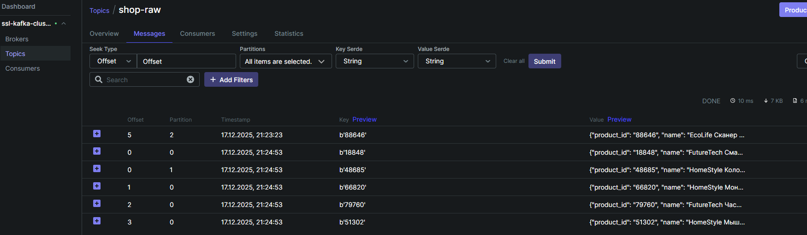

Лог обработки

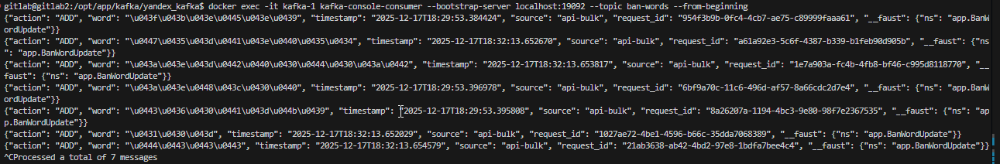

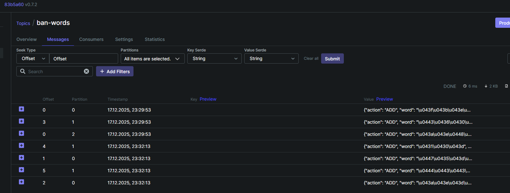

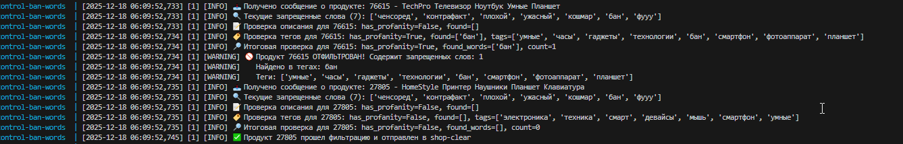

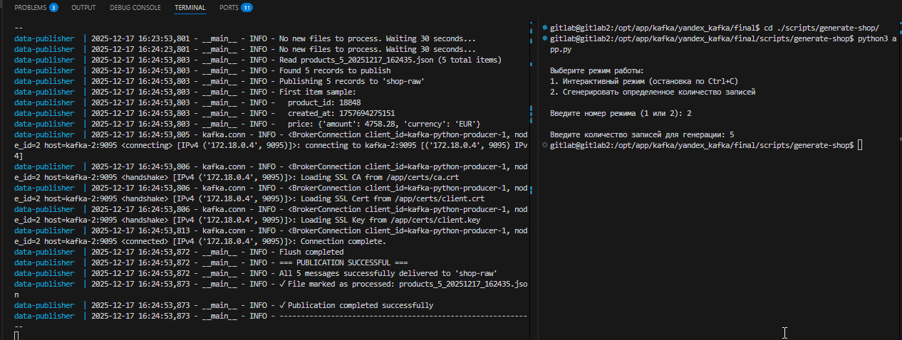

Сообщения в топике shop-clear

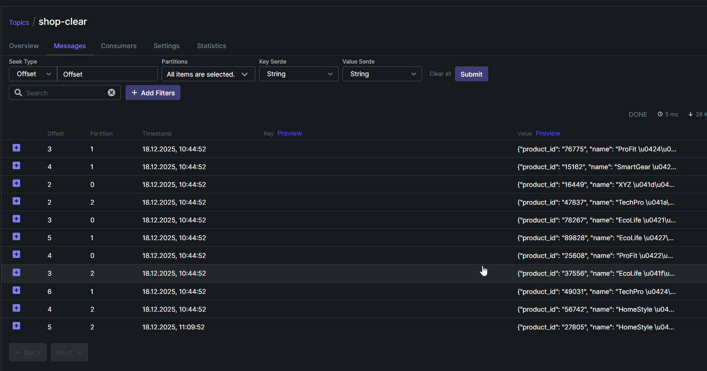


4. поднимаем secondary-kafka-cluster с 3 нодами и mirrormaker

```bash
docker compose -f docker-compose-3.yml up -d
# проверяем что топик отреплицировался
```

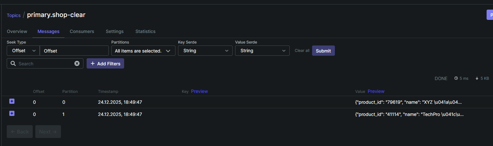


5. Cистема для хранения и поиска данных

```bash
# поднимем kafka-connect + kibana-8.15.1 + elasticsearch-8.15.1
docker compose -f docker-compose-4.yml up -d
sudo chown -R 1000:1000 ./elasticsearch
# создадим Elasticsearch connector в Kafka Connect
# проверяем наличие плагина io.debezium.connector.postgresql.PostgresConnector
curl localhost:8083/connector-plugins | jq
# конфигурируем коннектор
curl -X PUT -H 'Content-Type: application/json' \
--data @./files/elasticsearch-sink-connector.json http://localhost:8083/connectors/es-connector/config | jq
# проверяем статус коннектора
curl -s http://localhost:8083/connectors/es-connector/status | jq .
# проверяем проливку в es и поиск
```

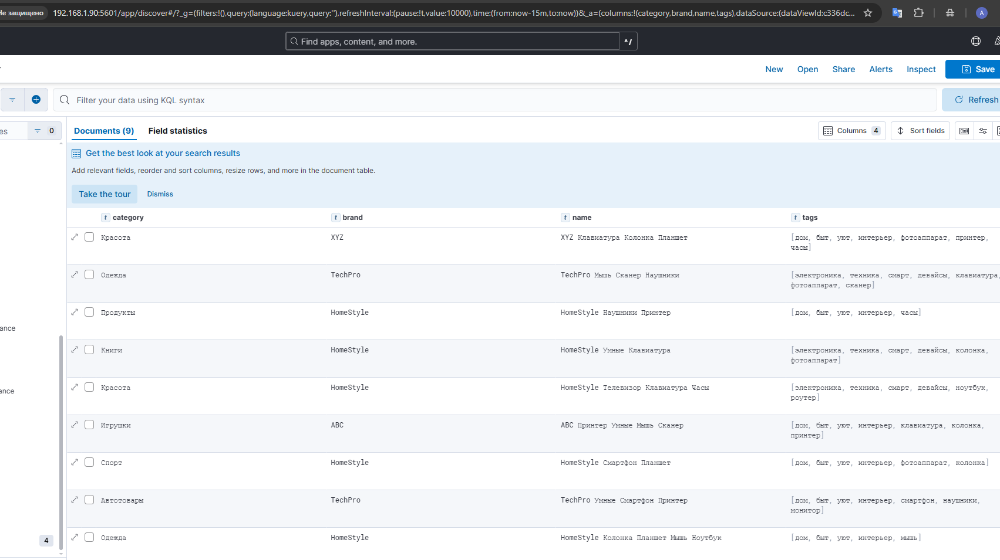

6. CLIENT API

```bash
# создадим топик cо списком запросов поиска клиента
docker exec -it kafka-1 kafka-topics --bootstrap-server kafka-1:19092 \
  --create \
  --topic client-searches \
  --partitions 3 \
  --replication-factor 3

# настроим ksqldb

CREATE STREAM SHOP_PRODUCTS_RAW (
    name STRING,
    category STRING
) WITH (
    KAFKA_TOPIC = 'primary.shop-clear',
    VALUE_FORMAT = 'JSON',
    KEY_FORMAT = 'KAFKA',
    PARTITIONS = 3
);

CREATE STREAM SHOP_PRODUCTS_KEYED AS
SELECT 
    name,
    category
FROM SHOP_PRODUCTS_RAW 
PARTITION BY category;

CREATE TABLE PRODUCTS_BY_CATEGORY
WITH (
    KAFKA_TOPIC = 'products_by_category',
    PARTITIONS = 3
) AS
SELECT 
    category,
    COLLECT_LIST(name) AS all_products,
    COUNT(*) AS product_count,
    ARRAY_JOIN(COLLECT_LIST(name), ', ') AS products_csv
FROM SHOP_PRODUCTS_KEYED
GROUP BY category
EMIT CHANGES;

CREATE STREAM client_searches_raw (
    id_client STRING,
    word_search STRING
) WITH (
    KAFKA_TOPIC = 'primary.client-searches',
    VALUE_FORMAT = 'JSON'
);

CREATE STREAM CLIENT_SEARCHES_KEYED AS
SELECT 
    id_client,
    word_search
FROM CLIENT_SEARCHES_RAW 
PARTITION BY word_search;

CREATE STREAM SEARCHES_WITH_PRODUCTS 
WITH (
    KAFKA_TOPIC = 'SEARCHES_WITH_PRODUCTS',
    PARTITIONS = 3,
    REPLICAS = 2,
    RETENTION_MS = 604800000
) AS 
SELECT 
    CS.ID_CLIENT AS CLIENT_ID,
    CS.WORD_SEARCH AS SEARCH_TERM,
    PBC.CATEGORY AS MATCHED_CATEGORY,
    PBC.PRODUCTS_CSV AS PRODUCTS_IN_CATEGORY,
    PBC.PRODUCT_COUNT AS TOTAL_PRODUCTS,
    PBC.ALL_PRODUCTS AS ALL_PRODUCTS_ARRAY
FROM CLIENT_SEARCHES_KEYED CS
LEFT JOIN PRODUCTS_BY_CATEGORY PBC 
ON CS.WORD_SEARCH = PBC.CATEGORY
EMIT CHANGES;

# запросим от имени клиента с id 123 поиск по слову Красота
curl -X POST "http://localhost:6078/search" \ \
     -H "Content-Type: application/json" \
     -d '{"id_client": "123", "word_search": "Красота"}'

# запросим рекомендации
curl --location 'http://localhost:8088/query-stream' \
--header 'Accept: application/vnd.ksqlapi.delimited.v1' \
--header 'Content-Type: application/vnd.ksql.v1+json' \
--data '{
  "sql": "SELECT * FROM SEARCHES_WITH_PRODUCTS WHERE CLIENT_ID = '\''123'\'' EMIT CHANGES LIMIT 10;",
  "properties": {
    "auto.offset.reset": "earliest"
  }
}'


# Мониторинг

Поднят кластер victoria metrics, grafana, alertmanager.

```bash
cd monitoring-stack
docker-compose up -d
# Тестируем срабатывание алерта
# создаем топик с rf=3
docker run --rm --network final_confluent \
  confluentinc/cp-kafka:latest \
  kafka-topics \
  --bootstrap-server kafka-1:19092 \
  --create \
  --topic test-alert \
  --partitions 3 \
  --replication-factor 3
Created topic test-alert.
```

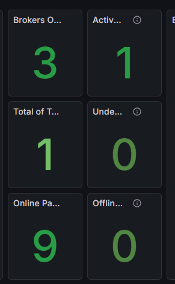

```bash
# складываем один брокер
docker compose -f ./docker-compose-1.yml stop kafka-3
```

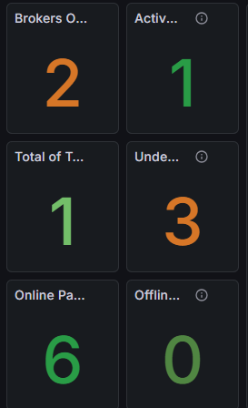

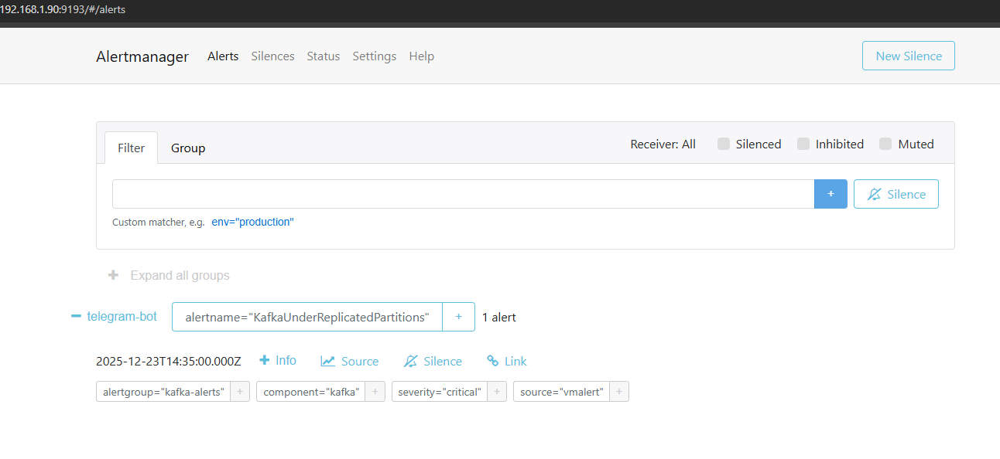

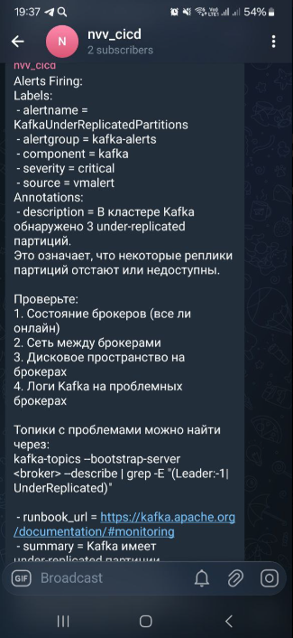

# Требования к окружению

python ~=3.11

docker 29.1.2

docker-compose 1.29.2

# Использованные технологии

zookeeper

zafka

victoria metrics

grafana

alertmanager