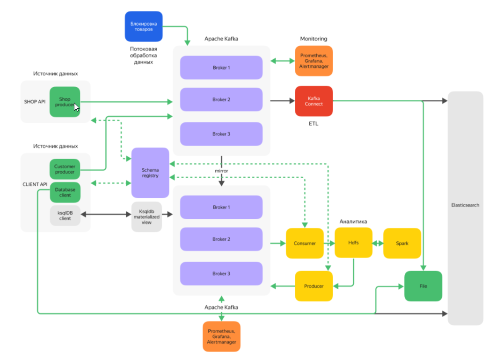

# Задание

## Бизнес-контекст

«Покупай выгодно» — платформа электронной коммерции. Ближайшая цель маркетплейса — улучшить клиентский опыт и оптимизировать бизнес-процессы. Для этого команда хочет внедрить аналитическую платформу, которая будет собирать данные о взаимодействии клиентов с сайтом: просмотры товаров, добавление в корзину, покупки и отзывы. Полученную информацию будут обрабатывать алгоритмы машинного обучения — они выявят паттерны поведения и предпочтений клиентов. 
В результате компания сможет показывать пользователям более релевантную рекламу, а также улучшить ассортимент товаров и качество обслуживания. Всё это повысит уровень удовлетворённости клиентов, увеличит конверсию и, как следствие, улучшит финансовые показатели компании.

## Архитектура системы

Тимлид и архитектор проекта продумали архитектуру системы. 
Источники данных для системы — SHOP API и CLIENT API. SHOP API позволяет магазинам отправлять данные о товарах, CLIENT API предоставляет пользователям сервиса возможность выполнять запросы.
Связывать все сервисы платформы и обеспечивать надёжную передачу данных будет Apache Kafka. Данные от магазинов (SHOP API) будут попадать в кластер Kafka. Для безопасной передачи данных кластер планируется настроить с использованием TLS. Данные записываются в топики, которые должны быть закрыты для записи другим клиентам.
Для повышения надёжности и отказоустойчивости системы планируется реализовать репликацию данных, а также дублировать данные на второй кластер.

Аналитическая система будет перекладывать данные из второго кластера Kafka в Data Lake, реализованный на базе HDFS (Hadoop Distributed File System). 
На основе этого Data Lake тимлид и архитектор предлагают развернуть платформу Apache Spark, которая будет выполнять аналитические вычисления.

Обработчик в реальном времени должен проверять данные от магазинов и пропускать только разрешённые товары. Товары из списка запрещённых нужно фильтровать, обрабатывать их не надо. Обработчик будет подключён к основному кластеру Apache Kafka.

Для обеспечения надёжности и отслеживания производительности кластера Kafka нужно реализовать мониторинг; планируется интеграция с Prometheus и Grafana.

Для тестирования и отладки функций сервисов нужно организовать хранилище данных.
Архитектура представлена на схеме ниже. 
Серым отмечены необязательные элементы. Цветовая раскраска соответствует модулям курса.  

## Задание. Разработать аналитическую платформу для маркетплейса

### Шаг 1. Создайте источники данных

Магазины взаимодействуют с платформой с помощью SHOP API, а клиенты — с помощью CLIENT API. 
Вам не нужно делать веб-сервисы, для проекта достаточно реализовать их эмуляцию.

#### SHOP API

Реализуйте чтение из файла и отправку товаров в Kafka.
Файл с данными должен также находиться под контролем версий в Git.
Магазины отправляют информацию о товарах в формате JSON с такой структурой:

{
  "product_id": "12345",
  "name": "Умные часы XYZ",
  "description": "Умные часы с функцией мониторинга здоровья, GPS и уведомлениями.",
  "price": {
    "amount": 4999.99,
    "currency": "RUB"
  },
  "category": "Электроника",
  "brand": "XYZ",
  "stock": {
    "available": 150,
    "reserved": 20
  },
  "sku": "XYZ-12345",
  "tags": ["умные часы", "гаджеты", "технологии"],
  "images": [
    {
      "url": "https://example.com/images/product1.jpg",
      "alt": "Умные часы XYZ - вид спереди"
    },
    {
      "url": "https://example.com/images/product1_side.jpg",
      "alt": "Умные часы XYZ - вид сбоку"
    }
  ],
  "specifications": {
    "weight": "50g",
    "dimensions": "42mm x 36mm x 10mm",
    "battery_life": "24 hours",
    "water_resistance": "IP68"
  },
  "created_at": "2023-10-01T12:00:00Z",
  "updated_at": "2023-10-10T15:30:00Z",
  "index": "products",
  "store_id": "store_001"
}

#### CLIENT API

Реализуйте команды, которые можно ввести в терминале:
поиск информации о товаре по его имени,
получение персонализированных рекомендаций.
Запросы от клиента должны поступать:
в Apache Kafka для последующей аналитики,
в систему для хранения и поиска данных, например, Elasticsearch или PostgreSQL.

### Шаг 2. Разверните Apache Kafka и настройте топики

Разверните Kafka-кластер.
Настройте безопасную передачу данных через TLS.
Создайте необходимые для работы топики.
Включите управление доступом (ACL) для защиты топиков.
Настройте отказоустойчивость:
Настройте репликацию данных для отказоустойчивости. Задайте минимальное количество синхронных реплик.
Реализуйте дублирование данных на второй кластер.

### Шаг 3. Разработайте аналитическую систему

Система аналитической обработки будет извлекать данные из второго кластера Kafka, анализировать их и выдавать персонализированные рекомендации. 
Реализуйте аналитическую систему одним из двух способов на ваш выбор: базовый или расширенный вариант. 
Базовый вариант. 
Перенесите данные в HDFS.
Обработайте данные, используя Spark. Сделайте аналитику по данным. Создание рекомендаций выходит за рамки курса, поэтому вычисления в системе могут быть любыми.
Запишите рекомендации в отдельный топик Kafka.
Расширенный вариант (задание со звёздочкой, необязательное). Реализуйте обработку данных в реальном времени, извлекая информацию из топиков Kafka:
Настройте извлечение данных. Система будет подписываться на нужные топики Kafka, чтобы получать данные о действиях пользователей и товарах в реальном времени.
Реализуйте расчёт рекомендаций. Создание рекомендаций выходит за рамки курса, поэтому вычисления в системе могут быть любыми.
Запишите рекомендации в отдельный топик Kafka.
Настройте выдачу рекомендаций. Используйте ksqlDB. При создании механизма хранения данных для топика, из которого считывает ksqlDB, ориентируйтесь на рекомендации официальной документации Confluent.

### Шаг 4. Реализуйте потоковую обработку данных

Система должна проверять, не входят ли товары магазинов в список запрещённых. Для этого нужно настроить потоковую обработку данных с помощью специальных библиотек. Используйте одну из трёх библиотек на свой выбор: Kafka Streams, Faust или Goka.
Создайте список товаров, запрещённых к продаже. Настройте возможность управления списком через интерфейс командной строки.
Настройте потоковую проверку данных: 
 a. Реализуйте извлечение данных о товарах из топиков Kafka, куда они поступают от магазинов.
 b. Проверьте, находятся ли товары в списке запрещённых. 
 c. Отфильтруйте запрещённые товары, чтобы они не обрабатывались дальше.

### Шаг 5. Настройте систему для хранения и поиска данных

Реализуйте базу данных одним из способов на выбор: базовый или расширенный вариант. 
Базовый вариант
Настройте запись данных в файл для отладки системы.
Для записи в файл используйте Kafka Connect.
Настройте запись так чтобы в хранилище попадали только отфильтрованные данные.
Убедитесь, что система корректно записывает данные в файл.
Такое решение не подходит для продакшна, но поможет протестировать и отладить функции сервисов.
Расширенный вариант. Используйте систему хранения и поиска данных — например, Elasticsearch или PostgreSQL.

### Шаг 6. Настройте мониторинг Kafka

Настройте Prometheus и сбор метрик:
Подключите JMX Exporter к Kafka.
Настройте сбор метрик.
Создайте дашборд в Grafana. Визуализируйте собранные метрики.
Настройте Alertmanager. Создайте алерты — оповещение при падении брокера.
Дополнительно (по желанию). Подключите мессенджер для уведомлений, например, Telegram.

### Шаг 7. Оформите документацию

В файле README.md: 
Напишите инструкцию по запуску.
Опишите, какие инструменты использовали.
Поясните реализацию.

### Критерии выполненной работы

Kafka успешно передаёт данные между сервисами
Включена защита TLS, и работают ACL (ограничение доступа к топикам)
Реализована репликация топиков и задано минимальное число реплик
Настроено дублирование данных во второй Kafka-кластер
Выполнена фильтрация запрещенных товаров
Данные после фильтрации записываются в систему хранения
Реализована аналитическая обработка данных
Рекомендации записываются в отдельный топик Kafka
Настроен мониторинг
-дашборд Grafana отображает ключевые метрики
-Alertmanager отправляет оповещения при сбоях
-метрики собираются через Prometheus и JMX Exporter;
Документация оформлена:
-есть файл README.md с инструкцией по запуску
-перечислены использованные технологии
-описана архитектура и логика реализации проекта

