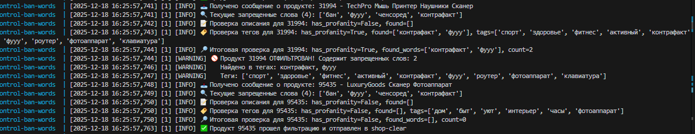
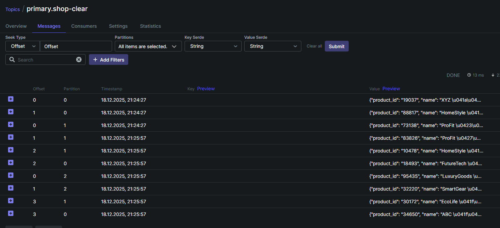

#  MVP «Покупай выгодно» — платформа электронной коммерции.

## Последовательность запуска проекта

```bash
# Поднимем NFS-сервер
sudo apt install nfs-kernel-server
sudo apt install nfs-common
sudo mkdir -p /opt/nfs/share
sudo chown nobody:nogroup /opt/nfs/share
sudo chmod 777 /opt/nfs/share
sudo nano /etc/exports
> /opt/nfs/share 192.168.1.0/24(rw,sync,no_subtree_check,no_root_squash)
sudo exportfs -a (sudo exportfs -r)
sudo systemctl start nfs-kernel-server
sudo systemctl enable nfs-kernel-server
sudo ufw enable
sudo exportfs -v
sudo mkdir -p /mnt/nfs_share
sudo vi /etc/fstab
> 192.168.1.90:/opt/nfs/share  /mnt/nfs_share  nfs  defaults  0  0
sudo mount -t nfs 192.168.1.90:/opt/nfs/share /mnt/nfs_share
mkdir -p /opt/nfs/share/data/products
ls -la /opt/nfs/share
```

```bash
# Сгенерим сертификаты для kafka-brokers и kafka-clients (подробно в readme/ssl.md)
# по хорошему их хорошо бы качать из защищенного хранилища при сборке и старте сервисов, но я сложу просто в /opt/nfs/share/data
# поднимем first-kafka-cluster, second-kafka-cluster, kafka-ui, schema-registry, mirror-maker, kafka-connect, client-api, data-publisher, control-ban-words
docker compose -f docker-compose-2.yml up -d
```

```bash
# поднимем hadoop+spark
docker compose -f docker-compose-2.yml up -d
# # предварительно было сделано:
# sbt package
# # Запуск Spark job
# docker exec spark-master spark-submit \
#   --master spark://spark-master:7077 \
#   --packages org.apache.spark:spark-sql-kafka-0-10_2.12:3.5.0 \
#   --class CompleteRecommender \
#   --executor-memory 2G \
#   --total-executor-cores 4 \
#   /jobs/kafka-recommender_2.12-1.0.jar
```

```bash
# Топик для публикации неочищенного потока товаров от магазинов
docker exec -it kafka-1 kafka-topics --bootstrap-server kafka-1:19092 \
  --create \
  --topic shop-raw \
  --partitions 3 \
  --replication-factor 3

# Топик c очищенным потоком товаров от магазинов
docker exec -it kafka-1 kafka-topics --bootstrap-server kafka-1:19092 \
  --create \
  --topic shop-clear \
  --partitions 3 \
  --replication-factor 3

# Топик cо списком запрещенных слов
docker exec -it kafka-1 kafka-topics --bootstrap-server kafka-1:19092 \
  --create \
  --topic ban-words \
  --partitions 3 \
  --replication-factor 3

# Топик c запросами от клиентов поиска товаров
docker exec -it kafka-1 kafka-topics --bootstrap-server kafka-1:19092 \
  --create \
  --topic client-searches \
  --partitions 3 \
  --replication-factor 3

# Топик c рекомендациями для клиентов
docker exec -it kafka-second-1 kafka-topics.sh \
  --bootstrap-server localhost:9092 \
  --create \
  --topic client-recommendations \
  --partitions 3 \
  --replication-factor 3  

# выдаем ACL
docker exec -it kafka-1 kafka-acls \
  --bootstrap-server kafka-1:19092 \
  --add \
  --allow-principal "User:CN=kafka-client" \
  --operation All \
  --topic '*' \
  --group '*' 
docker exec -it kafka-1 kafka-acls \
  --bootstrap-server kafka-1:19092 \
  --add \
  --allow-principal "User:CN=kafka-1,L=Moscow,OU=Practice,O=Yandex,C=RU" \
  --operation All \
  --topic '*' \
  --group '*'  

```

```bash
# зарегистрируем схему shop-raw-value
curl -X POST -H "Content-Type: application/vnd.schemaregistry.v1+json" \
  --data @./files/product-schema.json \
  http://localhost:8081/subjects/shop-raw-value/versions

# зарегистрируем схему client-searches-value
curl -X POST \
  -H "Content-Type: application/vnd.schemaregistry.v1+json" \
  --data '{
    "schema": "{\"type\":\"record\",\"name\":\"ClientSearch\",\"fields\":[{\"name\":\"client_id\",\"type\":\"string\"},{\"name\":\"search_words\",\"type\":{\"type\":\"array\",\"items\":\"string\"}},{\"name\":\"timestamp\",\"type\":{\"type\":\"long\",\"logicalType\":\"timestamp-millis\"}}]}"
  }' \
  http://localhost:8081/subjects/client-searches-value/versions

# проверим что зарегистрировалась 
curl http://localhost:8081/subjects/shop-raw-value/versions/latest

# занесем слова в топик ban-words (сервис сontrol-ban-words)
curl -X POST http://localhost:6068/api/v1/banned-words/bulk-add   -H "Content-Type: application/json"   -d '{"words": ["бан", "ченсоред", "контрафакт", "фууу" ]}'

# сгенерим файлы с товарами от магазинов
python3 -m venv .venv
source .venv/bin/activate
cd scripts/generate-shop
pip install -r requirements.txt
python3 app.py

# проверим, что отработал сервис сontrol-ban-words - в топике shop-clear отсутствуют сообщения, содержащие ban-words
```



```bash
# проверим, что отработала репликация mm - есть сообщения в топике primary.shop-clear
```



```bash
# обратимся к сервису client-api
curl http://localhost:6078/health | jq
#  1. сделаем запросы поиска товара по ключевым словам с уникальным id клиента (публикация в топик client-search)
curl -X POST http://localhost:6078/search \
  -H "Content-Type: application/json" \
  -d '{
    "client_id": "123",
    "search_words": ["мода", "стиль"]
  }'
curl -X POST http://localhost:6078/search \
  -H "Content-Type: application/json" \
  -d '{
    "client_id": "321",
    "search_words": ["быт", "уют"]
  }'  
# сообщения появились в топиках обоих кластеров
#  2. получим персональные рекоммендации (запрос данных из топика client-recommendations) по id клиента
curl -X GET "http://localhost:6078/recommendations?client_id=123&max_messages=5" | jq
```

echo '123:{"product_id": "p001", "name": "Ноутбук ASUS ROG", "score": 0.95}' | \
docker exec -i kafka-second-1 /opt/bitnami/kafka/bin/kafka-console-producer.sh \
  --bootstrap-server localhost:9092 \
  --topic client-recommendations \
  --property "parse.key=true" \
  --property "key.separator=:"