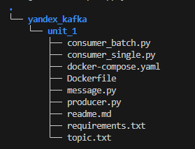

# Практическая работа 2 курса https://practicum.yandex.ru/profile/kafka/?from=learn_subscriptions-with-prof-recommendations

## Шаг 0. Создайте кластер из 3 нод

```bash
docker compose up -d zookeeper kafka-1 kafka-2 kafka-3 kafka-ui schema-registry
# проверяем топики
docker exec -it kafka-1 /usr/bin/kafka-topics --list --bootstrap-server kafka-1:9092
# проверяем доступность Kafka UI
curl http://localhost:8080
```

## Шаг 1. Создайте топик с 3 партициями и 2 репликами через консоль.

```bash
# создаем топик requests
docker exec -it kafka-1 /usr/bin/kafka-topics --bootstrap-server kafka-1:9092 --create --topic requests --partitions 3 --replication-factor 2
# проверяем свойства топика
docker exec -it kafka-1 /usr/bin/kafka-topics --bootstrap-server kafka-1:9092 --describe --topic requests
```

### Шаг 2. Создайте приложение, состоящее из 1 продюсера и 2 консьюмеров

Продюсер будет отправлять сообщения в Kafka-топик (модель push).
Подсказка. Хотя продюсер использует асинхронный метод для отправки сообщений, продюсер и консьюмеры работают с потоками данных.
Поэтому для них применяйте те же условия, что и при работе с любыми io-потоками.

Первый консьюмер (SingleMessageConsumer) должен считывать по одному сообщению, обрабатывать его и коммитить оффсет автоматически.
Второй консьюмер (BatchMessageConsumer) должен считывать минимум по 10 сообщений за один poll, обрабатывать сообщения в цикле и один раз коммитить оффсет после обработки пачки.
Подсказка. Изучите, как работает метод poll(), и поэкспериментируйте с настройками fetch.min.bytes и fetch.max.wait.ms. fetch.min.bytes определяет минимальный объём данных (в байтах), который консьюмер должен получить за один запрос к брокеру Kafka (запрос будет ожидать, пока не накопится достаточно данных). Параметр fetch.max.wait.ms в Kafka определяет максимальное время ожидания для получения данных от брокера Kafka. Если брокер не может предоставить запрошенные данные в течение этого времени, он отправляет пустой ответ.

При ручном управлении вам понадобится писать дополнительный код, чтобы подтвердить смещения коммитов. Для этого вызовите правильный метод у консьюмера после десериализации сообщения: consumer.commit(asynchronous=False) (Python).

Консьюмеры должны уметь работать параллельно и считывать одни и те же сообщения.
Это значит, что у каждого типа консьюмера должен быть уникальный group_id.
Если возникает ошибка, консьюмеры должны записывать сообщение о ней в логи и продолжать работать.
Приложение нужно запустить в двух экземплярах.
С этим поможет параметр replicas в docker-compose.

### Шаг 3. Реализуйте сериализацию и десериализацию. Формат данных выберите по желанию

Создайте класс сообщения и сериализуйте его в выбранном формате перед отправкой в Kafka. Выведите отправляемое сообщение на консоль.
Реализуйте десериализацию сообщений в консьюмерах. Выведите полученное сообщение на консоль.
В случае, если возникли проблемы с сериализацией или десериализацией в каждом из классов, выведите сообщение на консоль.

### Шаг 4. Обеспечьте гарантии доставки сообщений

Настройте подтверждение доставки. Для продюсера используйте гарантию At Least Once («Как минимум один раз»).
Подсказка. Вспомните, как работает параметр acks.
Настройте параметр retries в продюсере

### Как должен выглядеть результат

Выполненное задание должно включать:
Рабочий код с чёткой структурой.
docker-compose для старта кластера.
Пояснения в свободной форме:
В комментариях в коде поясните, какой выставленный параметр в классах за что отвечает.
В файле Readme.md опишите классы и инструкцию по запуску и проверке вашего решения. Поясните принцип работы приложения или его отдельных классов. Укажите шаги, по которым можно проверить, что ваше приложение работает в соответствии с заданием.
Файл topic.txt, в котором находятся:
Команда консоли, которой был создан топик.
Подробная информация о созданном топике. Вывести подробную информацию о топике поможет команда:
kafka-topics.sh --describe --topic my-topic --bootstrap-server localhost:9092

#### Описание решения

Проект состоит из одного продюсера и двух типов консьюмеров для Apache Kafka.
Продюсер отправляет сообщения в топик, а консьюмеры читают их с разной стратегией обработки.

Структура проекта:



1. Для поднятия продюсера и консумеров:

```bash
docker compose build producer
docker compose up --no-deps producer
docker compose build single-consumer
docker compose up -d --no-deps single-consumer
docker compose build batch-consumer
docker compose up -d --no-deps batch-consumer
```

#### Принцип работы

- Продюсер каждые 2 секунды отправляет новые сообщения о запросах в топик `requests`.
- SingleMessageConsumer:
  - Читает по одному сообщению.
  - Автоматически коммитит оффсеты.
- BatchMessageConsumer:
  - Читает минимум по 10 сообщений за раз.
  - Обрабатывает их в цикле.
  - После обработки пачки вручную коммитит оффсет.

#### Проверка задания

- Сообщения регулярно появляются в Kafka UI в топике `requests`.
- Продюсер пишет сообщения без ошибок.
- SingleMessageConsumer обрабатывает сообщения по одному.
- BatchMessageConsumer обрабатывает минимум 10 сообщений за раз.
- Реализована обработка ошибок.
- Используется сериализация и десериализация в топике `requests` с типом json.
- Настроены гарантии доставки в продюсере (`acks=all`, `retries > 0`).

### Как отправить работу на проверку

Выполните работу. Решение залейте в папку вашего репозитория на GitHub.
Сделайте репозиторий доступным для ревью.
Пришлите ссылку на GitHub.
