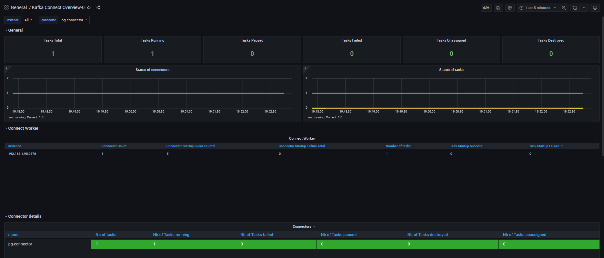

# Практическая работа 5

## Назначение сервисов

1. PostgreSQL
Назначение: Источник данных (база-источник изменений)
Хранит исходные данные в таблицах users и orders
Генерирует изменения (INSERT, UPDATE, DELETE) через WAL (Write-Ahead Log)
Обеспечивает логическое декодирование (logical decoding) для захвата изменений
Роль в цепочке: Поставщик данных, который "сообщает" о всех изменениях

2. Kafka Connect с Debezium
Назначение: Коннектор-источник (Source Connector)
Реализует коннектор Debezium для PostgreSQL
Захватывает изменения из WAL PostgreSQL в реальном времени
Преобразует изменения БД в сообщения Kafka
Обеспечивает надежную доставку и обработку ошибок
Роль в цепочке: "Мост" между PostgreSQL и Kafka, трансформирующий изменения БД в сообщения

3. Kafka Brokers (Kafka-0, Kafka-1, Kafka-2)
Назначение: Брокеры сообщений (распределенная очередь)
Хранят сообщения в топиках (customers.public.users, customers.public.orders)
Обеспечивают отказоустойчивость через репликацию
Гарантируют порядок доставки сообщений в партициях
Обрабатывают поток данных в реальном времени
Роль в цепочке: "Трубопровод" для надежной передачи и временного хранения сообщений

4. Kafka UI
Назначение: Визуализация и управление
Предоставляет веб-интерфейс для мониторинга Kafka кластера
Показывает топики, сообщения, потребителей
Позволяет просматривать данные в реальном времени
Упрощает отладку и мониторинг данных
Роль в цепочке: "Панель управления" для визуального контроля за потоком данных

Поток данных между сервисами:
text
PostgreSQL → Kafka Connect → Kafka Brokers → Schema Registry → Kafka UI
     ↓              ↓              ↓               ↓              ↓
  Генерирует   Захватывает    Хранит и        Регистрирует   Визуализирует
  изменения    изменения      распределяет     схемы         и позволяет
  в таблицах   из WAL         сообщения        данных        управлять

## Задание 1. Настройка Debezium Connector для PostgreSQL

1. Выполним поднятие сервисов с помощью команды

```bash
docker compose up -d
```

2. Создадим таблицы в pg

```sql
CREATE TABLE users (
    id SERIAL PRIMARY KEY,
    name VARCHAR(100),
    email VARCHAR(100),
    created_at TIMESTAMP DEFAULT CURRENT_TIMESTAMP
);
CREATE TABLE orders (
    id SERIAL PRIMARY KEY,
    user_id INT REFERENCES users(id),
    product_name VARCHAR(100),
    quantity INT,
    order_date TIMESTAMP DEFAULT CURRENT_TIMESTAMP
);
```

3. Создадим конфигурацию для работы с Debezium Connector (файл connector.json)

```bash
# проверяем наличие плагина io.debezium.connector.postgresql.PostgresConnector
curl localhost:8083/connector-plugins | jq
# конфигурируем коннектор
curl -X PUT -H 'Content-Type: application/json' --data @connector.json http://localhost:8083/connectors/pg-connector/config | jq
# проверяем список коннекторов
curl -s http://localhost:8083/connectors | jq .
# проверяем статус коннектора
curl -s http://localhost:8083/connectors/pg-connector/status | jq .
```


4. Добавляем записи в таблицы pg и проверяем, что появились топики с нашими данными

```sql
INSERT INTO users (name, email) VALUES ('John Doe', 'john@example.com');
INSERT INTO users (name, email) VALUES ('Jane Smith', 'jane@example.com');
INSERT INTO users (name, email) VALUES ('Alice Johnson', 'alice@example.com');
INSERT INTO users (name, email) VALUES ('Bob Brown', 'bob@example.com');
INSERT INTO orders (user_id, product_name, quantity) VALUES (1, 'Product A', 2);
INSERT INTO orders (user_id, product_name, quantity) VALUES (1, 'Product B', 1);
INSERT INTO orders (user_id, product_name, quantity) VALUES (2, 'Product C', 5);
INSERT INTO orders (user_id, product_name, quantity) VALUES (3, 'Product D', 3);
INSERT INTO orders (user_id, product_name, quantity) VALUES (4, 'Product E', 4);
```


5. Получим данные из топиков Apache Kafka и выведем их в терминал.

```bash
# создадим окружение
python3 -m venv .venv
# активируем окружение
source .venv/bin/activate
# поставим зависимости
pip install -r requirements.txt
# создадим файл с переменными
cat > .env << EOF
KAFKA_BOOTSTRAP_SERVERS=localhost:9094,localhost:9095,localhost:9096
KAFKA_TOPICS=customers.public.users,customers.public.orders
KAFKA_CONSUMER_GROUP=python-debezium-consumer
KAFKA_AUTO_OFFSET_RESET=earliest
EOF
# запустим скрипт на чтение данных из топиков
python kafka_consumer.py
```

Проапдейтим строку:

update orders set product_name = 'Super Puper Laptop' where id = 1;


Удалим две строки:

delete from orders where id in (2,3);


## Задание 2. Мониторинг и анализ метрик

Настроен Prometheus для сбора метрик из Kafka Connect.
Созданы графики в Grafana для визуализации метрик передачи данных и мониторинга работоспособности Kafka Connector.



