# Kafka в production и интеграция Kafka с Big Data экосистемой

## Задание 1.Развёртывание и настройка Kafka-кластера в Yandex Cloud для продакшн-среды.

Для продакшена необходимо:
1. как минимум по 3 брокера и 3 ноды крафт 
2. для брокеров:
- ram 64 гб
- диски ssd (от 12 штук по 1тб) объединенные в raid10
3. для крафт нод:
- ram 4 гб
- диски ssd (64гб)

В связи с тем, что стоимость кластера из 3 брокеров и 3 нод крафта с дисками по 10 в режиме PRESTABLE уже насчитали почти 40 тысяч в месяц,
а так же в связи с длительными ожиданиями от техподдержки по проблемам связанным с поднятием нод,
реально поднимала кластер попроще для тестов (конфигурация terraform приложена в папке kafka_cluster).

```bash
cd kafka_cluster
export YC_TOKEN=$(yc iam create-token)
export YC_CLOUD_ID=$(yc config get cloud-id)
export YC_FOLDER_ID=$(yc config get folder-id)
terraform init -upgrade
terraform apply -auto-approve
```

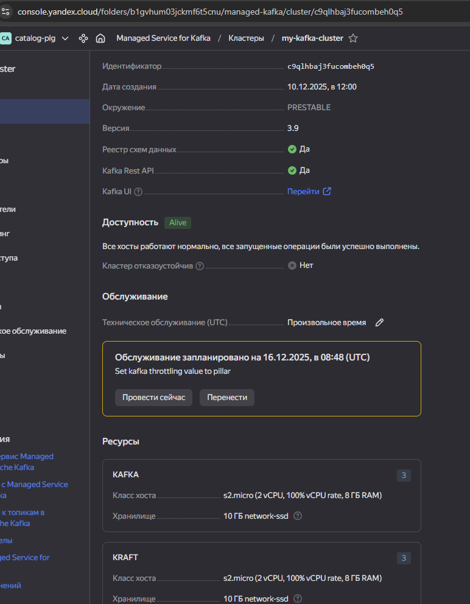

```bash
# установка сертификата яо
# https://yandex.cloud/ru/docs/managed-kafka/operations/connect/#get-ssl-cert
sudo mkdir -p /usr/local/share/ca-certificates/Yandex && \
sudo wget "https://storage.yandexcloud.net/cloud-certs/CA.pem" \
     --output-document /usr/local/share/ca-certificates/Yandex/YandexInternalRootCA.crt && \
sudo chmod 0655 /usr/local/share/ca-certificates/Yandex/YandexInternalRootCA.crt
openssl x509 -in /usr/local/share/ca-certificates/Yandex/YandexInternalRootCA.crt -text -noout

# Регистрация схемы данных
# https://yandex.cloud/ru/docs/managed-kafka/tutorials/managed-schema-registry-rest
curl \
      --cacert /usr/local/share/ca-certificates/Yandex/YandexInternalRootCA.crt \
      --request POST \
      --url 'https://rc1a-b3q1bldvbed6jut7.mdb.yandexcloud.net:443/subjects/test-schema/versions' \
      --user admin_user:superpuperpass \
      --header 'Content-Type: application/vnd.schemaregistry.v1+json' \
      --data "@../test-schema.json"
# Проверка схемы данных
curl \
      --cacert /usr/local/share/ca-certificates/Yandex/YandexInternalRootCA.crt \
      --request GET \
      --url 'https://rc1a-b3q1bldvbed6jut7.mdb.yandexcloud.net:443/subjects' \
      --user admin_user:superpuperpass
>> ["test-schema"]
curl \
      --cacert /usr/local/share/ca-certificates/Yandex/YandexInternalRootCA.crt \
      --request GET \
      --url 'https://rc1a-b3q1bldvbed6jut7.mdb.yandexcloud.net:443/subjects/test-schema/versions' \
      --user admin_user:superpuperpass
>>[1]
# Вывод команды kafka-topics.sh --describe.
yc managed-kafka topic list --cluster-name my-kafka-cluster
yc managed-kafka topic get test-topic --cluster-name my-kafka-cluster
```

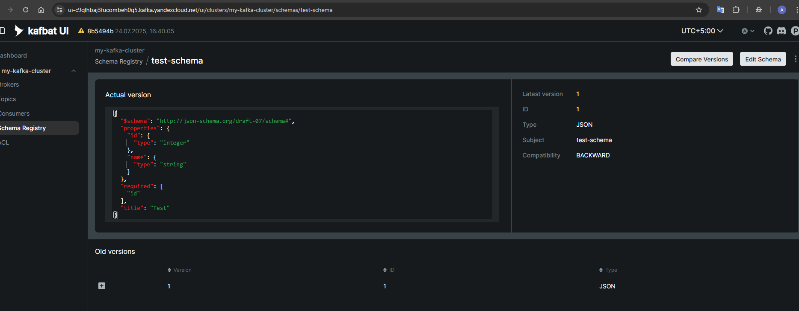

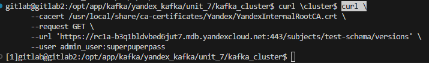

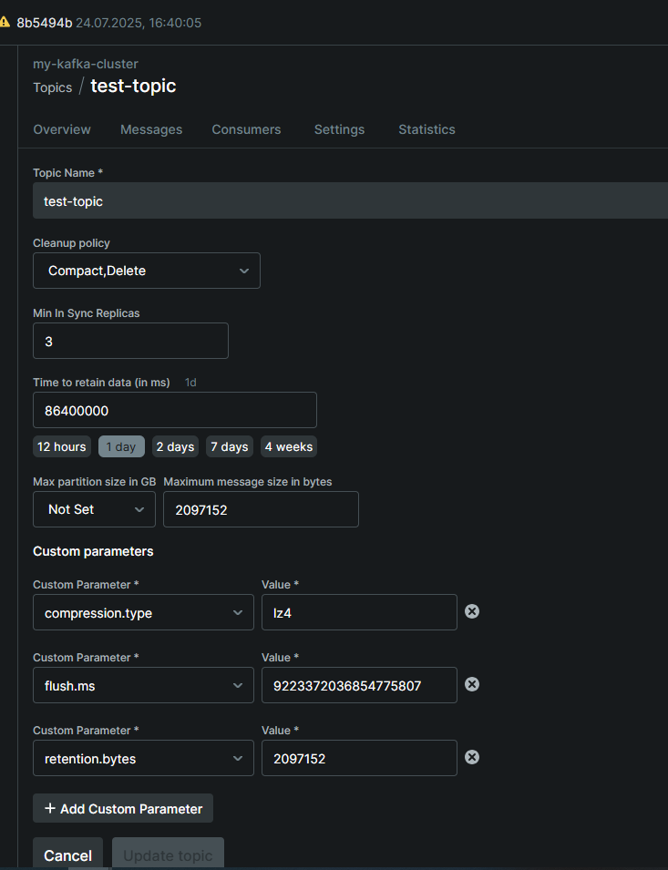

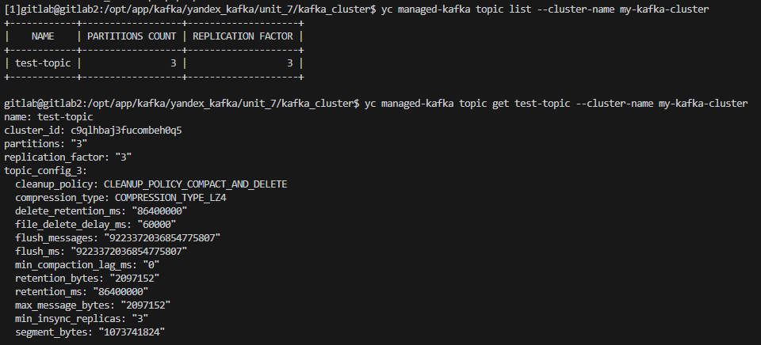

```bash
# подготовка окружения
curl -LsSf https://astral.sh/uv/install.sh | sh
uv venv
uv pip install -r requirements.txt
source .venv/bin/activate
# Запуск приложений
python3 producer.py
python3 consumer.py
```

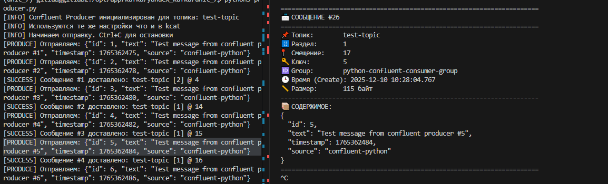

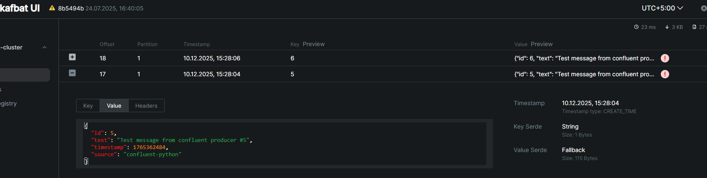

## Задание 2. Интеграция Kafka Apache NiFi


```bash
# поднимаем nifi И kafka
cd nifi
docke-compose up -d
```

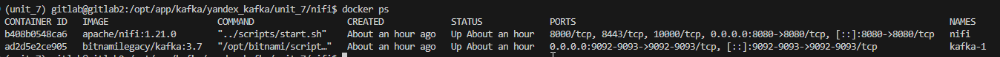

```bash
# создаем топик 
docker exec -it kafka-1 /opt/bitnami/kafka/bin/kafka-topics.sh   --bootstrap-server kafka-1:9092   --create --topic nifi-topic
```

Настраиваем flow в nifi

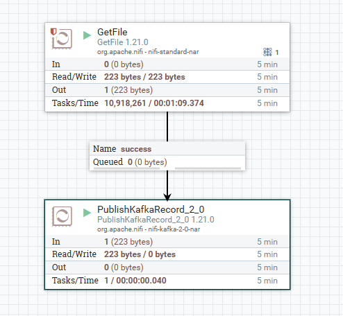

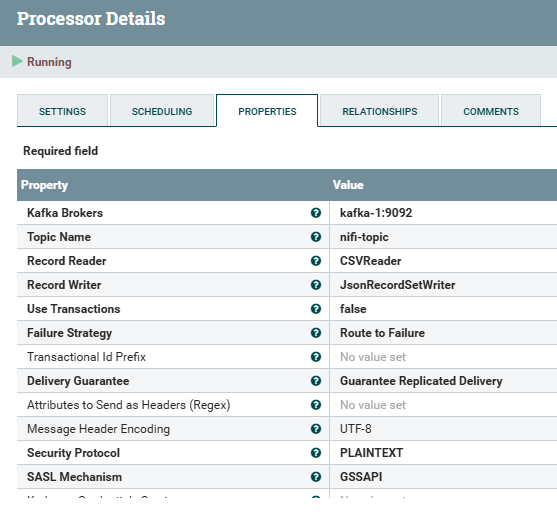

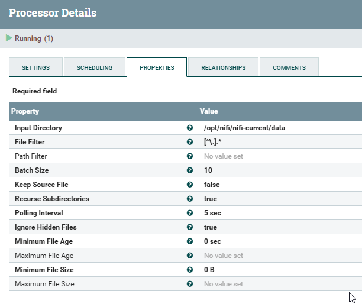

```bash
# запускам консумер
python3 ./consumer.py
# параллльно подаем файл на вход процессору
sudo cp input.csv ./nifi_data
```

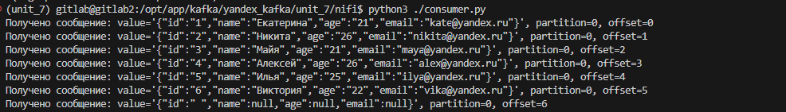


